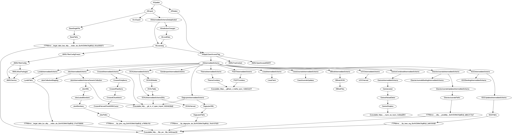

# siskin

Various tasks for heterogeneous metadata handling for project
[finc](https://finc.info) at [Leipzig University Library](https://www.ub.uni-leipzig.de). Based on
[luigi](https://github.com/spotify/luigi) from Spotify.

We use a couple of [scripts](bin) in the repository to harvest about twenty
[data sources](siskin/sources) of various flavors (FTPs, OAIs, HTTPs), mix and
match CSV, XML and JSON, run conversions and deduplication to create a single
file that is indexable and conforms to a customized VuFind SOLR schema, running
on an unified index host serving part of the data in the online catalogs of
[partners](https://finc.info/de/anwender). Apart from this workflow, we use
many one-step conversion scripts to generate a custom [MARC](https://www.loc.gov/marc/bibliographic/) format.

[](https://zenodo.org/badge/latestdoi/21136499) [](https://www.repostatus.org/#active)

* Overview in a [few markdown slides](https://github.com/miku/siskin/blob/master/docs/ai-overview/slides.md)

Luigi (and other frameworks) allow to divide complex workflows into a set of
tasks, which form a
[DAG](https://en.wikipedia.org/wiki/Directed_acyclic_graph). The task logic is
implemented in Python, but it is easy to use external tools, e.g. via
[ExternalProgram](https://github.com/spotify/luigi/blob/master/luigi/contrib/external_program.py)
or [shellout](https://github.com/miku/gluish#easy-shell-calls). Luigi is
workflow glue and scales up (HDFS) and down (local scheduler).

More on Luigi:

* [Luigi docs](https://luigi.readthedocs.io/en/stable/)
* [Luigi presentation at LPUG 2015](https://github.com/miku/lpug-luigi)
* [Luigi workshop at PyCon Balkan 2018](https://github.com/miku/batchdata)
* [Data pipelines, Luigi, Airflow: everything you need to know](https://towardsdatascience.com/data-pipelines-luigi-airflow-everything-you-need-to-know-18dc741449b7)

More about the project:

* [Blog about index](https://finc.info/de/Archive/268) [de], 2015
* [Presentation at 4th VuFind Meetup](https://swop.bsz-bw.de/frontdoor/index/index/docId/1104) [de], 2015
* [Metadaten zwischen Autopsie und Automatisierung](https://www.bibliotheksverband.de/fileadmin/user_upload/Kommissionen/Kom_ErwBest/Tagungen/Erwkomm_Fortbild_Ddorf2018_Wiesenmueller.pdf#page=26) [de], 2018

Contents.

* [Install](#install)
* [Update](#update)
* [Run](#run)
* [Create an aggregated file for finc](#create-an-aggregated-file-for-finc)
* [Configuration](#configuration)
* [Software versioning](#software-versioning)
* [Schema changes](#schema-changes)
* [Task dependencies](#task-dependencies)
* [Evolving workflows](#evolving-workflows)
* [Development](#development)
* [Naming conventions](#naming-conventions)
* [Deployment](#deployment)
* [TODO](#todo)

----

## Install

```
$ pip install -U siskin
```

The siskin project includes a [bunch of
scripts](https://github.com/miku/siskin/tree/master/bin), that allow to create,
inspect or remove tasks or task artifacts.

Starting 02/2020, only Python 3 is supported.

Run `taskchecksetup` to see, what additional tools might need to be installed
(this is a manually [curated](https://git.io/fhZvG) list, not everything is
required for every task).

```shell
$ taskchecksetup
ok      7z
ok      csvcut
ok      curl
ok      filterline
ok      flux.sh
ok      groupcover
ok      iconv
ok      iconv-chunks
ok      jq
ok      marctexttoxml
ok      metha-sync
ok      oaicrawl
ok      pigz
ok      solrbulk
ok      span-import
ok      unzip
ok      wget
ok      xmllint
ok      yaz-marcdump
```

## Update

For siskin updates a

```
$ pip install -U siskin
```

should suffices. If newer versions of external program are required, than
please update those manually (e.g. via your OS' package manager).

## Run

List tasks:

    $ tasknames

A task is an encapsulation of a processing step and can be in theory, anything;
Typical tasks are: fetching data from FTP, OAI endpoint or an HTTP API, format
conversions, filters or reports. Many tasks are parameterized by date (with the
default often being *today*), which allows siskin to keep track, whether an artifact
is update-to-date or not.

Run simple task:

    $ taskdo DOAJHarvest

Documentation:

    $ taskdocs | less -R

Remove artefacts of a task:

    $ taskrm DOAJHarvest

Inspect the source code of a task:

```python
$ taskinspect AILocalData
class AILocalData(AITask):
    """
    Extract a CSV about source, id, doi and institutions for deduplication.
    """
    date = ClosestDateParameter(default=datetime.date.today())
    batchsize = luigi.IntParameter(default=25000, significant=False)

    def requires(self):
        return AILicensing(date=self.date)
    ...
```

## Create an aggregated file for finc

There are a couple of prerequisites:

* [ ] siskin is [installed](https://github.com/miku/siskin/#install)
* [ ] most additional tools are installed (or: output of the `taskchecksetup` is mostly green)
* [ ] credentials are [configured](https://github.com/miku/siskin/#configuration) in */etc/siskin/siskin.ini* or *~/.config/siskin/siskin.ini*
* [ ] some static data (that cannot be accessed over the net) is put into place (and configured in *siskin.ini*)
* [ ] sufficient disk space is available

The update process itself consists of various updates:

* all data sources (crossref, doaj, ...) are updated, as needed (e.g. FTP is synced, OAI is harvested, API, ...)
* the licensing data is fetched from [AMSL](https://amsl.technology)

This dependency graph of these operations can become complex:



However, if everything is put into place, a single command will suffice:

```shell
$ taskdo AIUpdate --workers 4
```

This can be a long running (hours, days) command, depending on the state of the already cached data.

Note: Currently a jour fixe (the 15th of a month) is used as default for the
licensing information (another task, called *AMSLFilterConfigFreeze* should be
run daily for this to work). The jour fixe can be overriden with the *current* information, by passing a parameter to the *AILicensing* task:

```
$ taskdo AIUpdate --workers 4 --AILicensing-override
```

Once the task is completed, the output of the two tasks:

* AIExport (solr)
* AIRedact (blob, currently [microblob](https://github.com/miku/microblob))

can be put into their respective data stores (e.g. via [solrbulk](https://github.com/miku/solrbulk)).

## Configuration

The siskin package harvests all kinds of data sources, some of which might be
protected. All credentials and a few other configuration options go into a
`siskin.ini`, either in `/etc/siskin/` or `~/.config/siskin/`. If both files
are present, the local options take precedence.

Luigi uses a bit of configuration as well, put it under `/etc/luigi/`.

Completions on task names will save you typing and time, so put
`siskin_compeletion.sh` under `/etc/bash_completion.d` or somewhere else.

```shell
$ tree etc
etc
├── bash_completion.d
│   └── siskin_completion.sh
├── luigi
│   ├── luigi.cfg
│   └── logging.ini
└── siskin
    └── siskin.ini
```

All configuration values can be inspected quickly with:

```
$ taskconfig
[core]
home = /var/siskin

[imslp]
listings-url = https://example.org/abc

[jstor]

ftp-username = abc
ftp-password = d3f
...
```

## Software versioning

Since siskin works mostly *on data*, software versioning differs a bit, but we
try to adhere to the following rules:

* *major* changes: *You need to recreate all your data from scratch*.
* *minor* changes: We added, renamed or removed *at least one task*. You will
  have to recreate a subset of the tasks to see the changes. You might need to change
  pipelines depending on those tasks, because they might not exist any more or have been renamed.
* *revision* changes: A modification within existing tasks (e.g. bugfixes).
  You will have to recreate a subset of the tasks to see this changes, but no new
  task is introduced. *No pipeline is broken, that wasn't already*.

These rules apply for version 0.2.0 and later. To see the current version, use:

```shell
$ taskversion
0.43.3
```

## Schema changes

To remove all files of a certain format (due to schema changes or such) it helps, if naming is uniform:

```shell
$ tasknames | grep IntermediateSchema | xargs -I {} taskrm {}
...
```

Apart from that, all upstream tasks need to be removed manually (consult the
[map](https://git.io/v5sdS)) as this is not automatic yet.

## Task dependencies

Inspect task dependencies with:

```shell
$ taskdeps JstorIntermediateSchema
  └─ JstorIntermediateSchema(date=2018-05-25)
      └─ AMSLService(date=2018-05-25, name=outboundservices:discovery)
      └─ JstorCollectionMapping(date=2018-05-25)
      └─ JstorIntermediateSchemaGenericCollection(date=2018-05-25)
```

Or visually via [graphviz](https://www.graphviz.org/).

```shell
$ taskdeps-dot JstorIntermediateSchema | dot -Tpng > deps.png
```

## Evolving workflows


## Development

To converge the project on a common format run:

```shell
$ make imports style
```

This will fix import order and code style in-place. Requires isort and yapf
installed. Should be executed under Python 3 only (as Python 2 isort seems to
have differing opinions).

Other tools:

* use [pylint](https://github.com/PyCQA/pylint), currently 9.18/10 with many errors ignored, maybe with [git commit hook](https://github.com/sebdah/git-pylint-commit-hook)
* use [pytest](https://docs.pytest.org/), [pytest-cov](https://pypi.org/project/pytest-cov/), coverage at 9%

## Naming conventions

Some conventions are enforced by tools (e.g. imports, yapf), but the following
may be considered as well.

### Task names and filenames

* task class names that produce MARC21 should have suffix MARC, e.g. ArchiveMARC
* task class names that produce intermediate schema files should have suffix IntermediateSchema, e.g. ArchiveIntermediateSchema
* task for a single source should share a prefix, e.g. ArchiveMARC, ArchiveISSNList
* source prefix names should follow the source names (e.g. site of publisher), in German: *vorlagegetreu*, e.g. DOAJHarvest, GallicaMARC
* potentially long source names can be shortened, e.g. Umweltbibliothek can become UmBi... in umbi.py
* it is recommended that the source file name follows the source name, e.g. DOAJ tasks live in doaj.py

### Module docstrings for tasks (and scripts)

Rough examples:

```python
# coding: utf-8
# pylint: ...
#
# Copyright 2019 ... GPL-3.0+ snippet
# ...
# @license GPL-3.0+ <http://spdx.org/licenses/GPL-3.0+>

"""

Source: Gallica
SID: 20
Ticket: #14793
Origin: OAI
Updates: monthly

Config:

[vkfilm]
input = /path/to/file
password = helloadmin

"""

```

### Quoting style

* use double quotes, if possible

### Executable

* if a module can be used as standalone script, then it should include the following line as first line:

```
#!/usr/bin/env python
```

### Python 2/3 considerations

* use [six](https://six.readthedocs.io/), if necessary
* use `__future__` imports if necessary
* prefer [io.open](https://docs.python.org/3/library/io.html#io.open) to raw open, e.g. Python 2 builtin has no keyword `encoding`
* string literals should be written with the `u` prefix (obsolete in Python 3, but required in Python 2)

### Debugging

* prefer logging over print statements

### Open for discussion

* one suffix for data acquisition tasks, e.g. Harvest, Get, Fetch, Download, ...

## Deployment

A distribution can be created via Makefile.

```shell
$ make dist
$ tree dist/
dist/
└── siskin-0.62.0.tar.gz
```

The tarball can be installed via [pip](https://pypi.org/project/pip/):

```
$ pip install siskin-0.62.0.tar.gz
```

If access to PyPI is possible, one can upload the tarball there with:

```
$ make upload
```

Which in turn allows to install siskin via:

```
$ pip install -U siskin
```

on the target machine.

## TODO

* [ ] The naming of the scripts is a bit unfortunate, `taskdo`, `taskcat`,
  .... Maybe better `siskin run`, `siskin cat`, `siskin rm` and so on.
* [ ] Investigate [pytest](https://docs.pytest.org/en/latest/) for testing tasks, given inputs.
