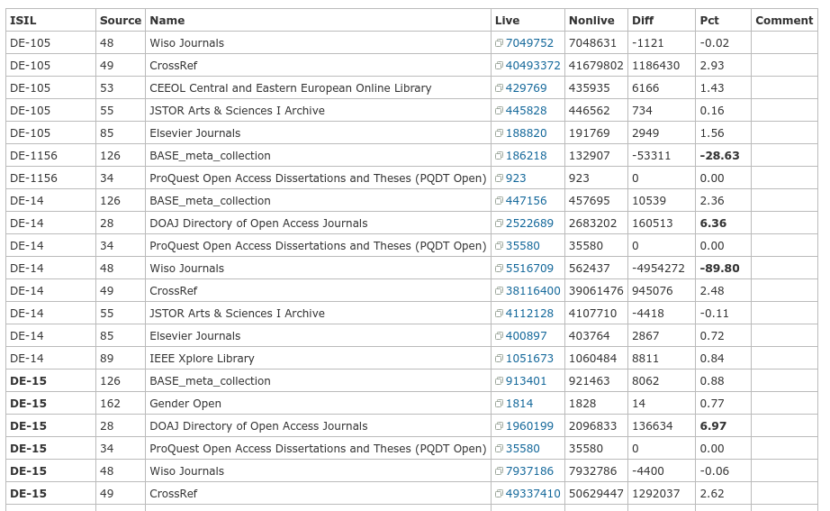

# Cheatsheet

> Long running scripts ahead; please run in screen or tmux (or anything else).

The current version?

```
$ taskversion
0.102.2
```

Where are all files located?

```
$ taskhome
/media/titan/siskin-data
```

## Create Files

Generate `AIExport` (solr) and `AIRedact` (blob) artifacts. This may take many
(6-24) hours, depending on the date and already finished tasks. One large
source, CrossRef, is updated monthly - and it takes a few hours to fetch the
new records from their API.

```
$ taskdo AIUpdate --workers 8 --AILicensing-override
```

While running, the progress can be inspected with `taskps` (in watch):

```
$ watch taskps
```

Once done, you can (hopefully) inspect task outputs:

```
$ taskls AIExport
$ taskls AIRedact
```

## Live Servers

Show live and nonlive solr servers.

```
$ curl -s ai.ub.uni-leipzig.de/whatislive

upstream microblob_live         { server 172.18.113.98:8820; }
upstream microblob_nonlive      { server 172.18.113.99:8820; }
upstream solr_live              { server 172.18.113.7:8085; }
upstream solr_nonlive           { server 172.18.113.15:8085; }
```

## SOLR

Delete the old data from index and reindex (nonlive server needs to be set manually; takes about 10h), e.g. with [solrbulk](https://github.com/ubleipzig/solrbulk):

```
$ time solrbulk -purge -purge-pause 20s -w 20 -verbose -z -server 172.18.113.15:8085/solr/biblio $(taskoutput AIExport)
```

## Blob

Sidenote: We currently use [microblob](https://github.com/ubleipzig/microblob)
as a key-value server (increasing the index size by adding the "intermediate"
JSON to the SOLR "fullrecord" field seemed like a bad idea at the time).

Copy blobfile to nonlive (e.g. 172.18.113.99) blobserver (takes about 20min).

```
$ scp $(taskoutput AIRedact) 172.18.113.99:/tmp
```

Log into nonlive blobserver:

```
$ ssh -A user@172.18.113.99
$ root -A
```

Important: delete any old blobserver files and associated leveldb directories:

```
$ cd /var/microblob
$ rm -rf date-*
```

Uncompress new file (takes about 20min), change owner to `daemon` (legacy user name, https://is.gd/aYr8C7).

Filename does not matter, but it used to be close to the compressed file name,
e.g. we uncompressed `date-2020-08-01.ldj.gz` into `date-2020-08-01.ldj` and so
on.

```
$ unpigz -c /tmp/date-2020-08-01.ldj.gz > /var/microblob/date-2020-08-01.ldj
$ chown daemon.daemon /var/microblob/date-2020-08-01.ldj
```

Edit the `/etc/microblob/microblob.ini` file. Adjust the path to the file.

```bash
[main]

file = /var/microblob/date-2020-08-01.ldj
addr = 0.0.0.0:8820
batchsize = 50000
key = finc.id
log = /var/log/microblob.log
```

Then restart microblob: this will first "index" the file (takes a good hour) then switch to "serve" mode.

```
$ systemctl restart microblob
```

When microblob finished indexing the file, it will respond to HTTP requests:

```
$ curl -s 172.18.113.99:8820 | jq .
{
  "name": "microblob",
  "stats": "http://172.18.113.99:8820/stats",
  "vars": "http://172.18.113.99:8820/debug/vars",
  "version": "0.2.6"
}
```

To lookup a document, the key can be used as path in the URL, like:

```
$ curl -s 172.18.113.99:8820/ai-49-aHR0cDovL2R4LmRvaS5vcmcvMTAuMTAzNy8xMDE2Ny0wMDU | jq -rc '.url'
["http://dx.doi.org/10.1037/10167-005"]
```

## Cleanup

Occasional cleanup with
[taskgc](https://git.sc.uni-leipzig.de/ubl/finc/index/siskin/-/blob/master/bin/taskgc).
This will interactively try to free disk space.

```
$ taskgc
```

## Switching servers

Edit nginx configuration snippet (on proxy):

```
$ vim /etc/nginx/which_SOLR-which_BLOB_is_live
```

Then check and reload:

```
$ nginx -t
$ systemctl reload nginx
```

It takes a few seconds (to minutes) until SOLR is warmed up.

## Compare live and nonlive SOLR servers

There is a [`span-compare`](https://github.com/ubleipzig/span/blob/master/cmd/span-compare/main.go) program, that when invoked with:

```
$ span-compare -e -t
```

will emit copy-and-pastable textile comparison table to stdout.



## Development

We use [`gitlab-ci.yml`](../.gitlab-ci.yml) and sonatype Nexus repository manager to publish new
versions.

* in [`siskin/__init__.py`](../siskin/__ini__.py) increment the version

Then.

* run `git commit`, by convention with commit message containing the version like so: "v1.2.3"
* run `git tag`, by convention using the version, like so: "v1.2.3"

```
$ git commit -m "v1.2.3"
$ git tag v1.2.3
```

Push changes to repository with `git push`, and also push tags with `git push
[remote] --tags` - this will trigger a build. After a few seconds, the build
should be copied over to nexus and will be installable via `pip install -U
siskin` on the target machine.

```
$ git push origin master
$ git push origin --tags
```
