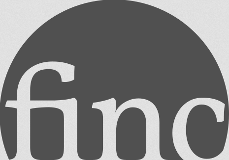
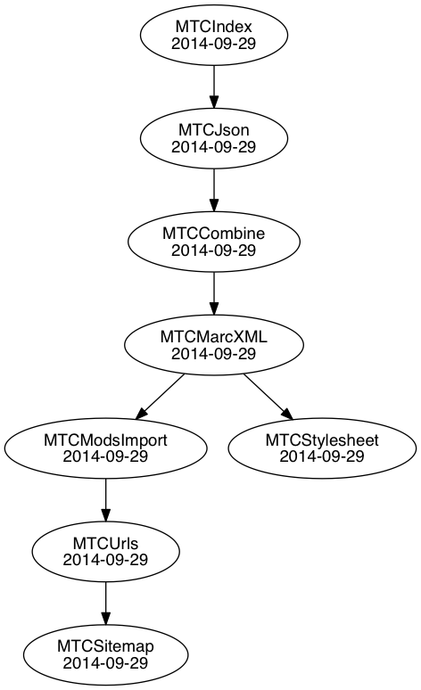

# about:ai



MARTIN CZYGAN UBL 2015-07-16 10:00


# Roadmap

* a few DISCLAIMERS
* first things first
* short introduction to the DEPENDENCY GRAPH
* high performance FILE CONVERSIONS
* LICENSE HANDLING
* solr and memcachedb UPDATES


## Disclaimers

Most of the software here is work-in-progress.

With "project AI" UBL seems to try to act like a startup in a
corporate environment, which is cute.


First commit:

> b5262ff 2015-01-06 | add crossref stub [Martin Czygan]

1090 commits across about 10 projects since then. That's about 5.5
commits per day - every day.

Finc SVN repository at the same time: 673 commits, 10 committers.


## Disclaimers

Can't you be more *entschleunigt*, you ask?

Have a look at:

http://www.slideshare.net/f.lohmeier/big-bibliographic-data-sca-ds-project-meeting-20150612/17

* "finc" - works fine with 100M records
* d:swarm - scalability issues, about 4M records per day!


## Disclaimers

I am really sorry, but ...

* the software will change,
* the update process will change and
* components will change.


## CentOS


* nothing but ♥ ♥ ♥
* https://asciinema.org/a/2gpcfhapf4bxv7lya2voo3egh

```sh
$ python -c "import sys; print(sys.version)"
2.6.6 (r266:84292, Nov 22 2013, 12:16:22)
[GCC 4.4.7 20120313 (Red Hat 4.4.7-4)]
```

## Dependencies



The dependency graph is the overall structure, that allow us to build
complex workflows.

The python project is called [siskin](https://github.com/miku/siskin).

It's on pypi, you can install it with:

```sh
$ pip install siskin
```
