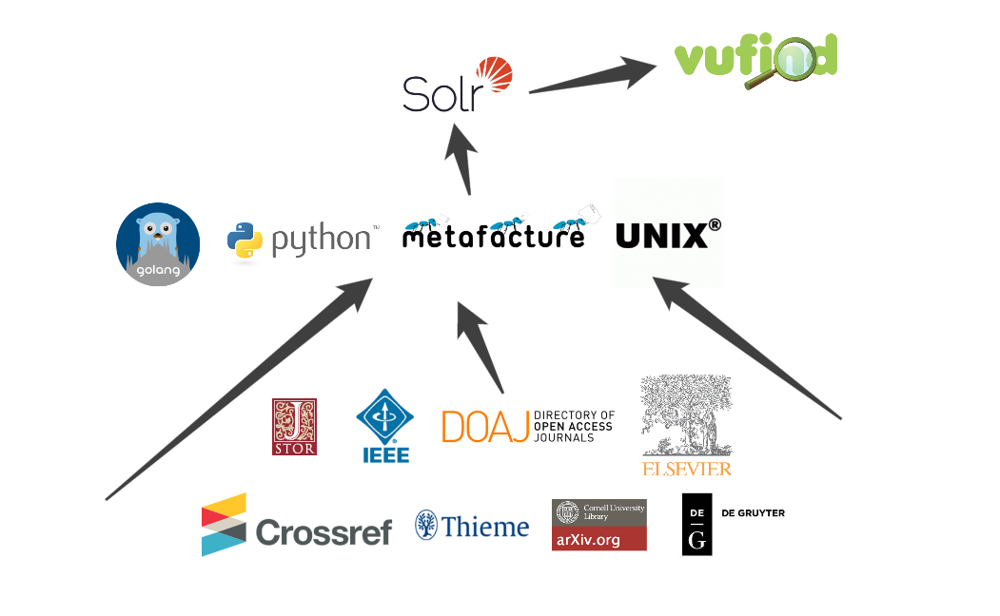
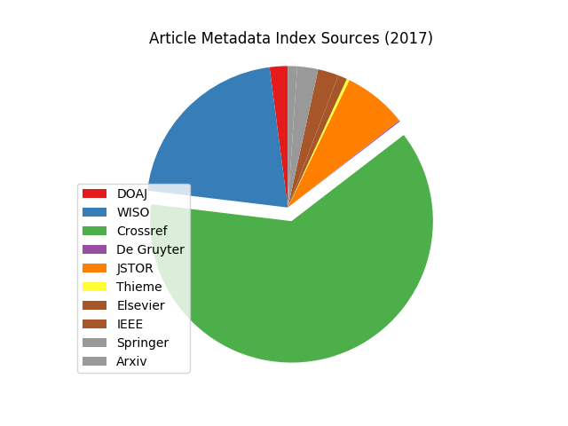
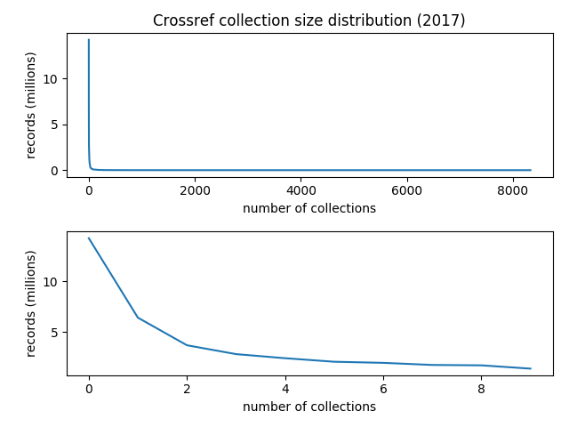
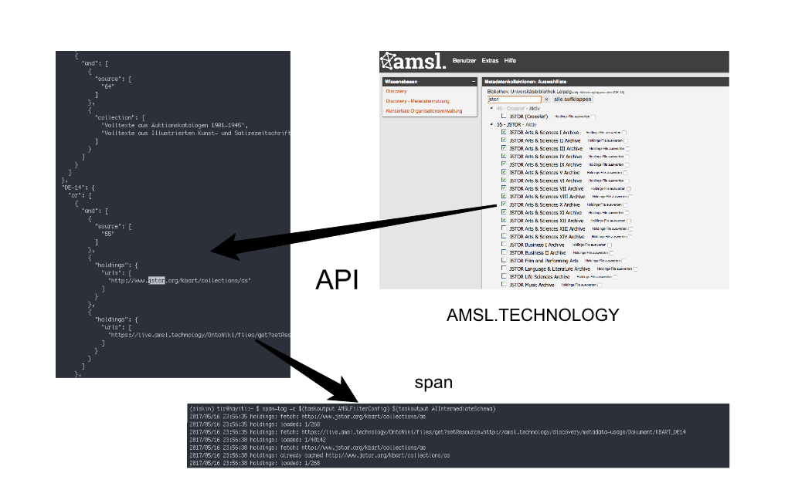
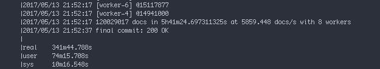
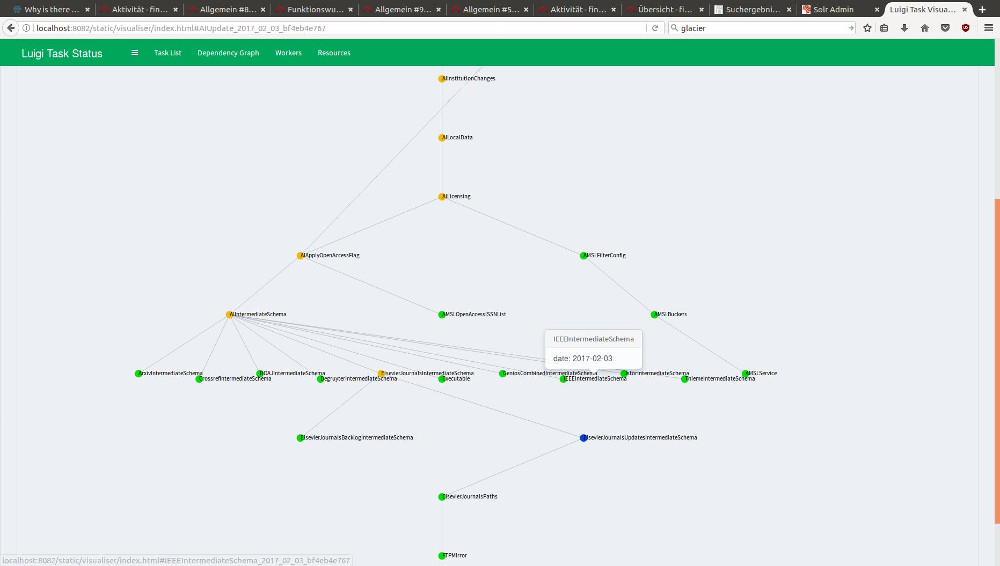
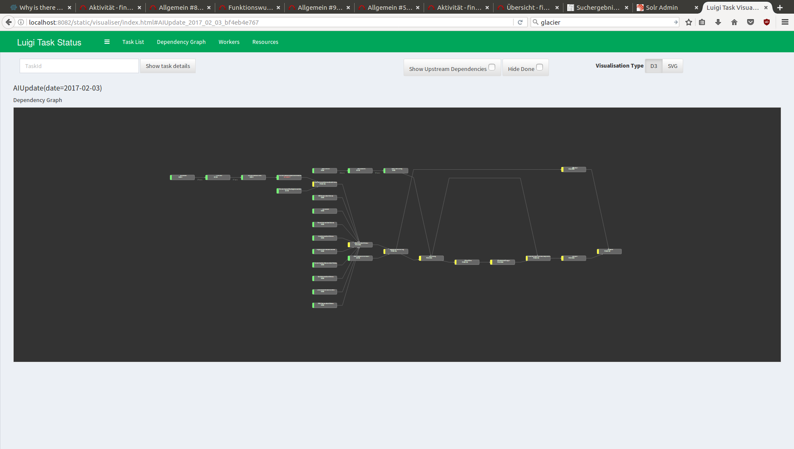
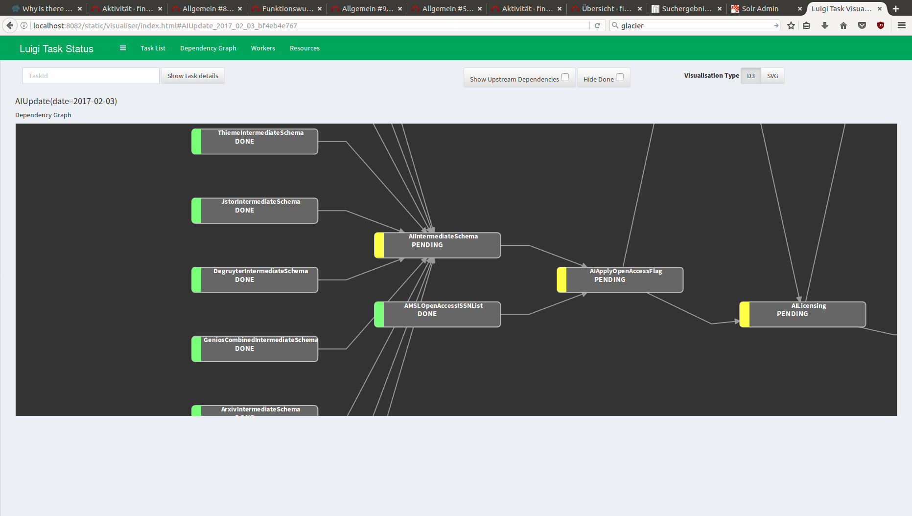
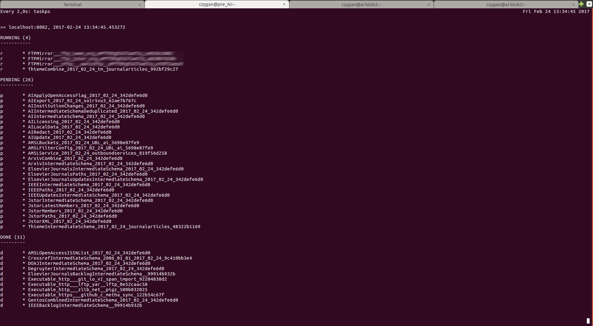
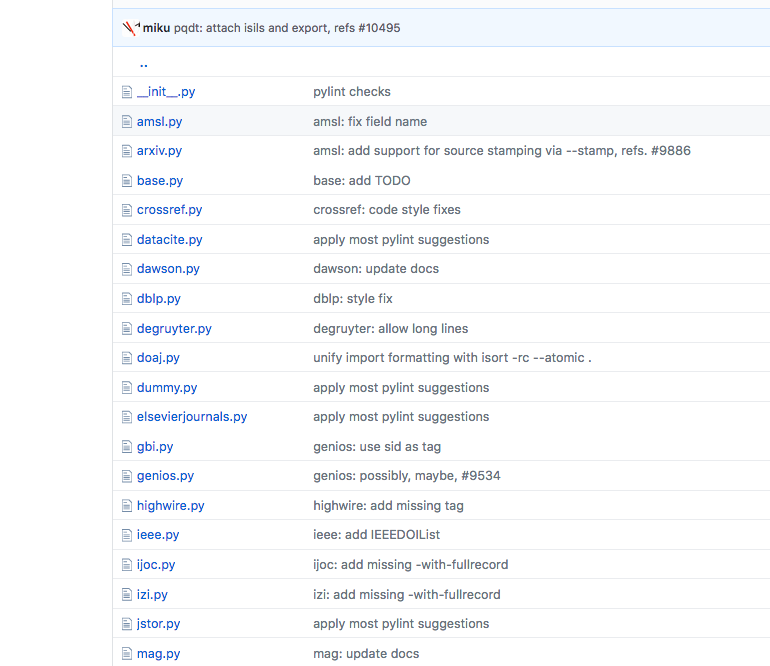

Building Metadata Indices
=========================

2017-05-17, 12:30-15:00, Leipzig University Library
[Martin Czygan](mailto:martin.czygan@uni-leipzig.de), [Tracy Hoffmann](mailto:tracy.hoffmann@uni-leipzig.de), [Robert Schenk](mailto:robert.schenk@uni-leipzig.de), et al.

----

Overview
========



----

Source distribution
===================



Around 118,221,121 articles in total. Only parts visible to libraries.

----

Collection distribution
=======================



----

Diversity
=========

* HTTP API (Crossref)
* FTP-Pull (Elsevier, IEEE)
* FTP-Push (WISO)
* Download (Springer)
* OAI-PMH (Arxiv, Thieme)
* Elasticsearch Backup (DOAJ)

Formats
-------

* XML
* JSON

----

Gallery of raw data
===================

* Examples from the data as provided.

----


```
<GENIOS Profile="manuell_IJAR" Dateissue="20170301T000311">
<Document ID="20051001" IDNAME="NO" DB="IJAR">
<Abstract>
This interview deals with the issue of ...
</Abstract>
<Authors>
<Author>Lola Cendales, Angelo Torres</Author>
</Authors>
<Descriptors><Descriptor>n.n.</Descriptor></Descriptors>
<Date>20050101</Date>
<Issue>1</Issue>
<ISSN>1862-1303</ISSN>
<ISBN>n.n.</ISBN>
<Subtitle>n.n.</Subtitle>
<Series-Title>n.n.</Series-Title>
<Editors><Editor>n.n.</Editor></Editors>
<Edition>n.n.</Edition>
<Language>n.n.</Language>
...
```

----

```
<article dtd-version="1.0" article-type="misc">
   <front>
      <journal-meta>
         <journal-id>14centyxqweeesdd</journal-id>
         <journal-id>j50000837</journal-id>
         <journal-title-group>
            <journal-title>
            14th Century English Newsletter
           	</journal-title>
         </journal-title-group>
         <publisher>...
         </publisher>
         <issn pub-type="ppub">01375840</issn>
      </journal-meta>
      <article-meta>
      ...
      </article-meta>
   </front>
</article>
...
```

----

```
{
  "status": "ok",
  "message-type": "work-list",
  "message-version": "1.0.0",
  "message": {
    "items-per-page": 1000,
    "items": [
      {
        "indexed": {
          "date-parts": [
            [
              2016,
              1,
              1
            ]
          ],
          "date-time": "2016-01-01T06:10:02Z",
          "timestamp": 1451628602718
        },
	....
...
```

----

```
{
  "sort": [
    "000011857dbc42afb0f1a8c7e35ab46f"
  ],
  "_type": "article",
  "_index": "doaj_v1",
  "_score": null,
  "_source": {
    "index": {
      "publisher": [
        "Press of International Journal of Ophthalmology"
      ],
      "schema_subject": [
        "LCC:Medicine",
        "LCC:Ophthalmology"
      ],
      "classification": [
        "Medicine",
        "Ophthalmology"
      ],
      ...

```

----

```
[
  {
    "shardLabel": "SLUB-dbod",
    "sourceID": "64",
    "megaCollection": "Perinorm - Datenbank Normen ...",
    "productISIL": null,
    "externalLinkToContentFile": null,
    "contentFileLabel": null,
    "contentFileURI": null,
    "linkToContentFile": null,
    "ISIL": "DE-105",
    "evaluateHoldingsFileForLibrary": "no",
    "holdingsFileLabel": null,
    "holdingsFileURI": null,
    "linkToHoldingsFile": null
  },
  ...
```

----

Basic steps
===========

* Synchronize data
* Normalize various formats
* Apply licencing information
* Postprocessing steps (e.g. deduplication)
* Create solr-importable format

----

Synchronize data
================

* https://lftp.yar.ru/ (FTP)
* https://github.com/ubleipzig/metha (OAI)
* [Requests: HTTP for Humans](http://docs.python-requests.org/en/master/)
* [pyelasticsearch](https://pyelasticsearch.readthedocs.io/en/latest/)

----

Synchronize data
================

```
$ lftp -u xxxxx,xxxxx -e "
set sftp:auto-confirm yes;
set net:max-retries 5;
set net:timeout 10;
set mirror:parallel-directories 1;
set ssl:verify-certificate no;
set ftp:ssl-protect-data true;
mirror --verbose=0 --only-newer -I '*' /
/tmp/siskin-data/common/FTPMirror/b57115...;
exit"
ftp.ieee.org
...
```

----

Synchronize data
================

```
$ metha-sync http://www.intechopen.com/oai/
...
$ metha-cat http://www.intechopen.com/oai/
<Record>
  <header status="">
    <identifier>oai:intechopen.com:4119</identifier>
    <datestamp>2005-03-01</datestamp>
  </header>
  <metadata>
    <oai_dc:dc>
	  <dc:title>
        Realization of a Service Robot for Cleaning ...
      </dc:title>
      <dc:creator>Jianwei Zhang</dc:creator>
      <dc:subject>
        International Journal of Advanced
        Robotic Systems
      </dc:subject>
      <dc:coverage>Volume 2</dc:coverage>
      ...
```

----

Synchronize data
================

```
while True:
    params = {
        'rows': rows,
        'filter': filter,
        'cursor': cursor
    }

    url = 'http://api.crossref.org/works?%s' % (...)

    for attempt in range(1, self.attempts):
        if not cache.is_cached(url):
            time.sleep(self.sleep)
            body = cache.get(url)

```

----

Normalization
=============

* [metafacture](https://github.com/culturegraph/metafacture-core/wiki)
* [span](https://github.com/ubleipzig/span)

----

Normalization
=============

> Metafacture: tool suite for metadata processing (German National Library)

Components: FLUX and MORPH.

```
// Example flux script.

fileName|
open-file|
decode-xml|
handle-generic-xml("Record")|
morph(FLUX_DIR + "morph.xml", *)|
encode-json|
write("stdout");
```

----

Normalization
=============

MORPH example:

```
<entity name="url[]" flushWith="record">
    <data source="metadata.dc.identifier.value">
        <regexp match="^(http.*)" format="${1}"/>
    </data>
</entity>
...
<data source="metadata.dc.type.value" name="rft.genre">
    <lookup in="genre_liste"/>
</data>
...
```

----

Normalization
=============

Everything normalized into a so-called [*intermediate schema*](https://github.com/ubleipzig/intermediateschema).

```
{
  "finc.format": "ElectronicArticle",
  "finc.mega_collection": "DOAJ Directory of ...",
  "finc.record_id": "ai-28-000011857dbc42afb0f1a8c7e35ab46f",
  "finc.source_id": "28",
  "ris.type": "EJOUR",
  "rft.atitle": "Study progresses on continuous ...",
  "rft.genre": "article",
  "rft.issn": [
    "1672-5123"
  ],
  "rft.jtitle": "Guoji Yanke Zazhi",
  "rft.pages": "1737-1740",
  "rft.pub": [
    "Press of International Journal of Ophthalmology ..."
  ],
  ...
```

----

Normalization
=============

Usually, we put all data into single file, once normalized.

```
$ taskls AIIntermediateSchema --date 2017-05-08
... 30G May 12 16:48 /.../AII.../date-2017-05-08.ldj.gz
```

Around 200G uncompressed. Includes abstracts, sometimes even full texts.

----

Licensing
=========

A complex piece.



----

Licensing
=========

A complex piece. But each library has fine-grained control over what is included in their catalog (sources, collections, licensing data, issn lists, ...)


----

Postprocessing
==============

Currently only DOI-based deduplication over all data sets. Using a custom command line [tool](https://github.com/miku/groupcover).

We also tested a few other things, e.g. include citation data from Microsoft Academic Graph.

Occasional automated quality checks - but not yet part of default workflow.

----

Postprocessing
==============

Deduplication via custom [tool](https://github.com/miku/groupcover) (similar to uniq):

```
$ cat x.csv
...
"ai-49-aHR0cDo...","49","10.1006/bulm.2002.0328", \
    "DE-14","DE-Brt1"
"dswarm-105-MT...","105","10.1006/bulm.2002.0328", \
    "DE-Mit1", "DE-14","DE-Brt1","DE-520","DE-15", \
    "DE-540","DE-D275"
...

$ groupcover -prefs '85 55 89 60 50 105 49 28 48 121' < x.csv
```

----

Last Steps
==========

Convert data into something SOLR understands, then index the data.

Move data from a single file into SOLR fast with [solrbulk](https://github.com/ubleipzig/solrbulk):

```
$ solrbulk -server localhost:8983/solr/biblio file.ldj
...
```



----

Last Steps
==========

We use a another key-value store, to keep the intermediate schema files. This is not strictly necessary, but might increase performance, as SOLR index is a bit smaller.

* used [memcachedb](https://code.google.com/archive/p/memcachedb/) (archived), switched to [microblob](https://github.com/miku/microblob) (fewer features, faster)

----

Orchestration
=============

Many different (usually small) tasks: Sync this FTP server, convert to this format, apply some licensing, do deduplication, export to some other format.

----

Orchestration
=============

* How to document these?

----

Orchestration
=============

We use a dedicated orchestration framework written in Python. It documents the workflows and makes them executable.

* https://github.com/spotify/luigi

> Luigi is a Python module that helps you build complex pipelines of batch jobs. It handles dependency resolution, workflow management, visualization etc. It also comes with Hadoop support built in.

Uses a dependency graph (DAG).

----

Orchestration
=============

Dependencies (analogy):

* [Pizza](https://is.gd/uKe3k3)

----

Orchestration
=============



----

Orchestration
=============



----

Orchestration
=============



----

Orchestration
=============



----

Orchestration
=============

* workflows are [extensible](https://raw.githubusercontent.com/miku/siskin/master/docs/catalog/AIExport.gif)
* all tasks executable via command line
* distributed as a normal [python package](https://pypi.python.org/pypi/siskin)

----

Development
===========

* open source
* with git (and github)
* each data source has a file containing *recipes*

----



----

Development
===========

* can create or modify new sources independent of existing workflows
* no central database
* strive for reproducability
* run on various OS (different Linux distributions, Mac OS X)

----

Development
===========

* Why [Python](https://www.python.org/)? It's [popular](https://www.tiobe.com/tiobe-index/) and has wide range of application in the scientific domain.
* Why [Metafacture](https://github.com/culturegraph/metafacture-core/wiki)? A comprehensive and declarative tool.
* Why UNIX? 40 plus years of [text processing](http://www.oreilly.com/openbook/utp/UnixTextProcessing.pdf).
* Why [Go](http://golang.org/)? It's fast and easy to deploy.

----

Outlook
=======

* more (new) sources
* migrating existing data sources into the DAG
* automated quality checks
* add more external information (e.g. citation graph) to the metadata

----

More
====

* https://github.com/ubleipzig
* https://github.com/finc
