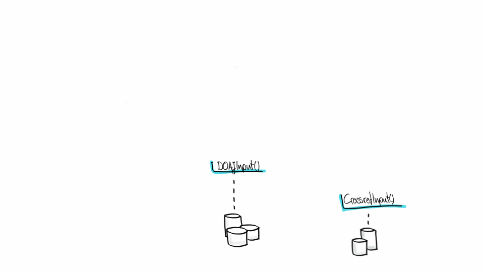
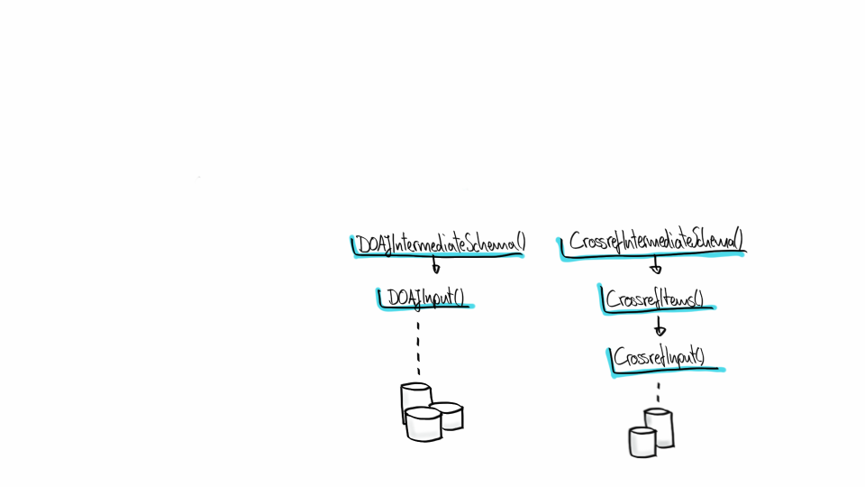
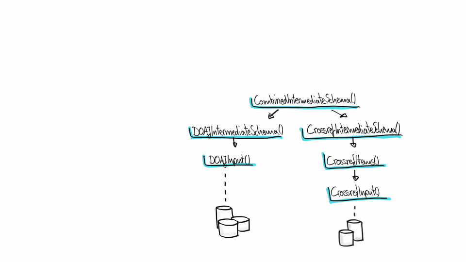
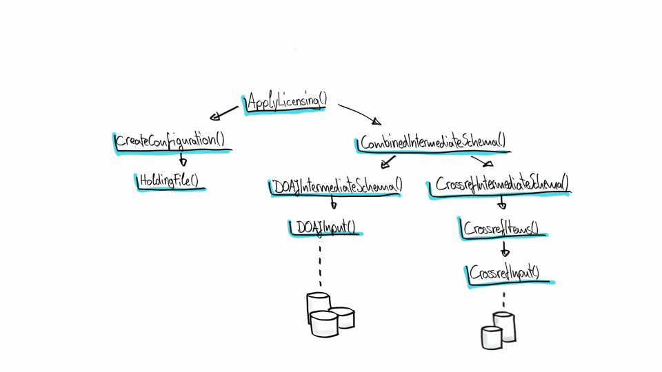
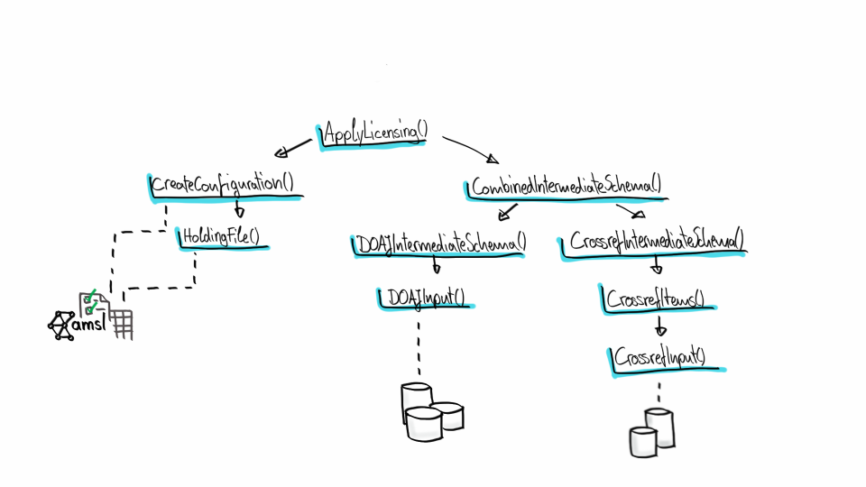
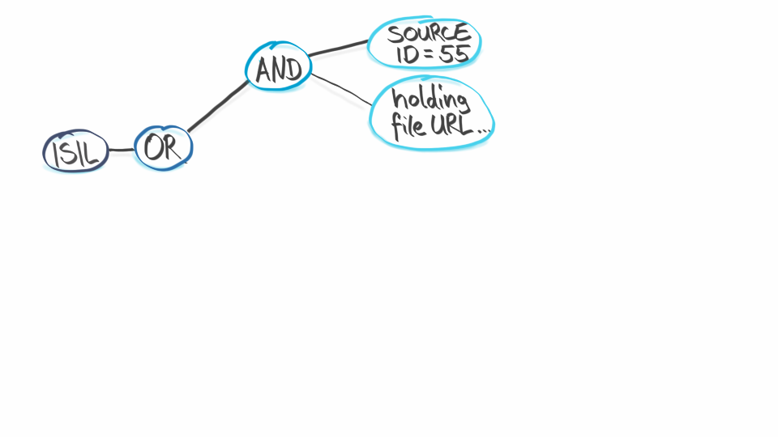
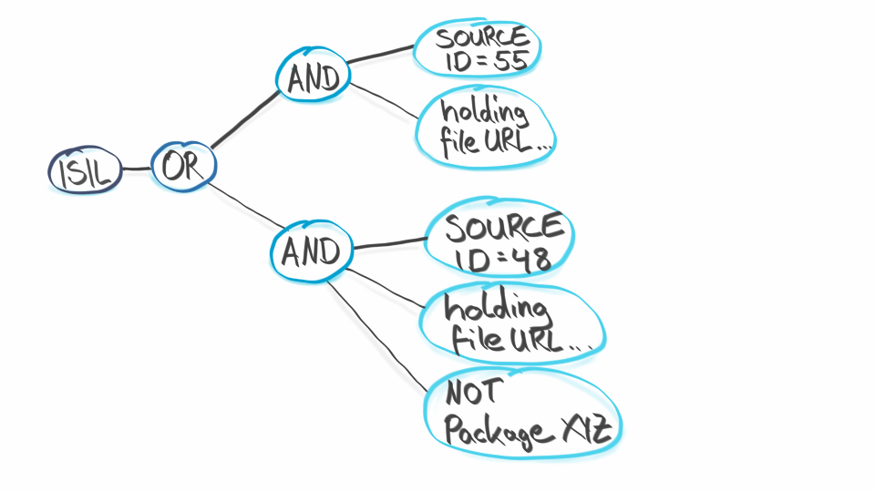
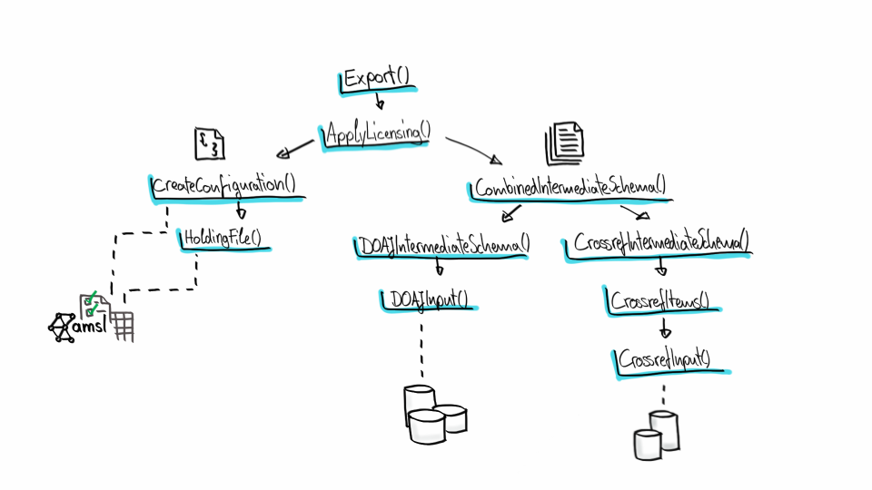
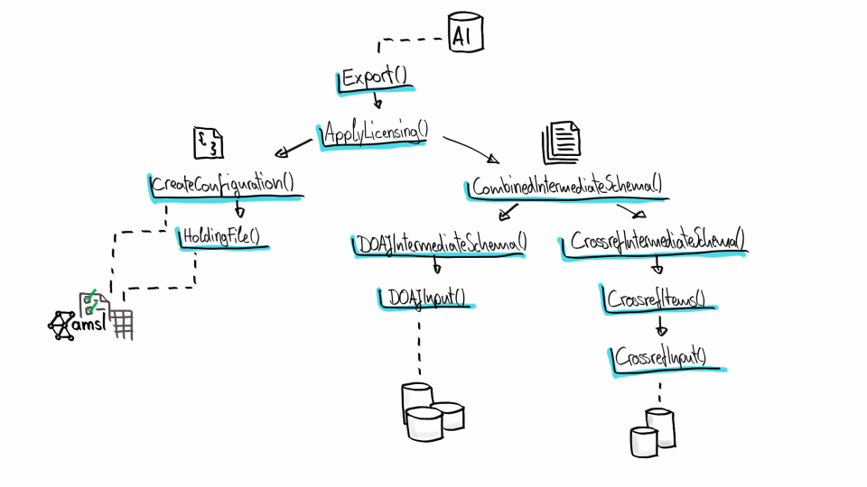
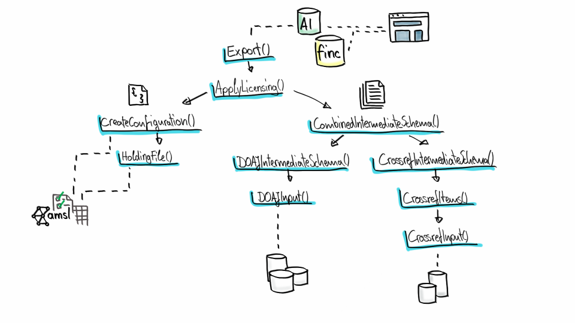

<!-- $size: 16:9 -->

Hands-On Lab: Build Your Own Index
==================================

> Heute baue ich meinen eigenen Artikelindex – Hands-On Workshop zum leichtgewichtigen Metadatenprozessing.

106. Deutscher Bibliothekartag, 2017-06-02, Frankfurt am Main

[Martin Czygan](mailto:martin.czygan@uni-leipzig.de), [Tracy Hoffmann](mailto:tracy.hoffmann@uni-leipzig.de), [Leipzig University Library](https://ub.uni-leipzig.de)

[https://ub.uni-leipzig.de](https://ub.uni-leipzig.de),
[https://finc.info](https://finc.info),
[https://amsl.technology](https://amsl.technology),
[itprojekte@ub.uni-leipzig.de](mailto:itprojekte@ub.uni-leipzig.de)

----

About
=====

* Hands-On: We encourage participants to write code and run things on their machines.

* Lightweight: An overused term.

----

Why lightweight?
================

* allows reuse of existing programs and libraries
* not too much code
* transparent and reproducable

----

Some stats
==========
* code that runs the aggregated index build process at UBL is about 5000 lines of code (lucene/index/IndexWriter.java)
* we reuse a lot of unix tools, we implement metafacture transformations, and custom tools (these are extra code, but they are also standalone tools)


---

Some concepts
==========
* iterative development
* recompute everything from raw data
* "simple things should be simple"

----

Other tools for ETL (T)
===========

* Toolsets:
  * Metafacture
  * Catmandu

<!-- Issues: Documentation, ... -->

* Data management platforms:
  * OpenRefine
  * KNIME

<!-- Issues: Flexibility, ... -->

----

Why build an own index for articles? (T)
==========

* Leaving block boxes behind - commercial index (Primo Central)
* Since 04.2015 in productive status
* 14% of overall klicks in cataloge

----


----

Source distribution (T)
===================


Around 118,221,121 articles in total. Only parts visible to libraries.

<!-- Example UBL > 47.000.000 AI-Records (vgl. > 5.000.000 others) -->

---

Now move forward...
===========

---

Basic steps
===========

* Synchronize data
* Normalize various formats
* Apply licencing information
* Postprocessing steps (e.g. deduplication)
* Create solr-importable format

---

Orchestration
===========

* Many different (usually small) tasks: Sync this FTP server, convert to this format, apply some licensing, do deduplication, export to some other format.

---

Orchestration
===========

* How to document these?
* Luigi
* Dependencies
* Tasks encapsulates a processing step (requirements, business logic
    and some result)
    
---
Orchestration
===========

Dependencies (analogy):

* [Pizza](https://is.gd/uKe3k3)

---
### Harvesting / Synchronize data


---
### Normalization


---

Normalization
=============

Everything normalized into a so-called [*intermediate schema*](https://github.com/ubleipzig/intermediateschema).

```
{
  "finc.format": "ElectronicArticle",
  "finc.mega_collection": "DOAJ Directory of ...",
  "finc.record_id": "ai-28-000011857dbc42afb0f1a8c7e35ab46f",
  "finc.source_id": "28",
  "ris.type": "EJOUR",
  "rft.atitle": "Study progresses on continuous ...",
  "rft.genre": "article",
  "rft.issn": [
    "1672-5123"
  ],
  "rft.jtitle": "Guoji Yanke Zazhi",
  "rft.pages": "1737-1740",
  "rft.pub": [
    "Press of International Journal of Ophthalmology ..."
  ],
  ...
```

----

Reuse tools for normalization: Metafacture
===============

> Metafacture: tool suite for metadata processing (German National Library)
* Bsp: Arxiv
* Flux + Morph

```
// Example flux script.

fileName|
open-file|
decode-xml|
handle-generic-xml("Record")|
morph(FLUX_DIR + "morph.xml", *)|
encode-json|
write("stdout");
```
----

Normalization with Metafacture (T)
=============

Morph example:

```
<entity name="url[]" flushWith="record">
    <data source="metadata.dc.identifier.value">
        <regexp match="^(http.*)" format="${1}"/>
    </data>
</entity>
...
<data source="metadata.dc.type.value" name="rft.genre">
    <lookup in="genre_liste"/>
</data>
...
```

---
### Put all data into single file, once normalized


---
### Licensing


---

Lizensierung
============

* Beispiel-Konfiguration

* AMSL Website + Screenshots

---
### Licensing (a complex piece)


---



---



---
### Postprocessing (e.g. dedup)


---

Dedup
=====

* groupcover

* andere Optionen?

----

ev. Anreicherung mit MAG
========================

---

### Convert data into something SOLR understands


---
### Index the data


---

Indexierung
===========

* VuFind

---
### Final steps


----

# WRAP-UP AND END

....
