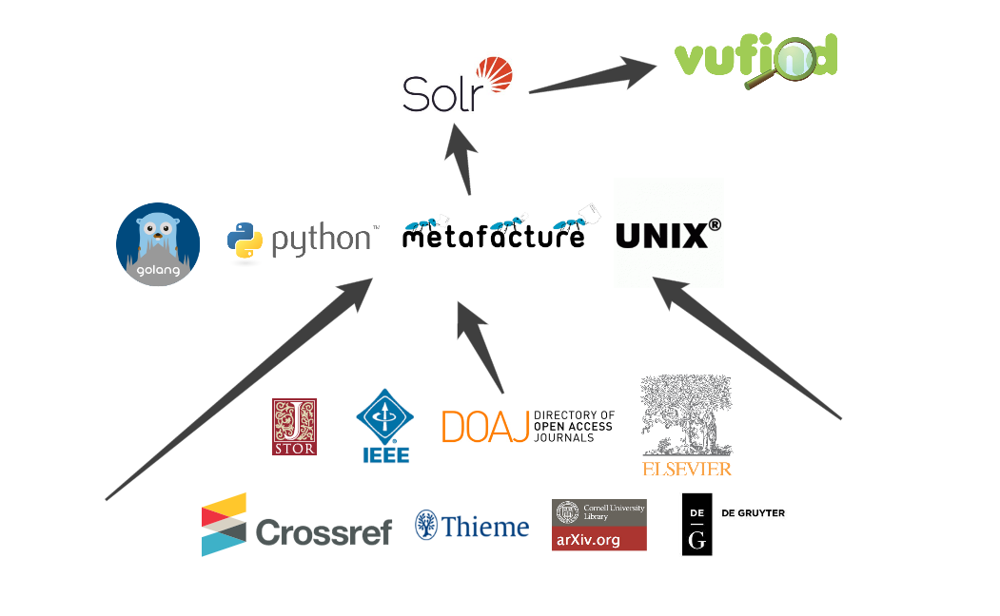

<!-- $size: 16:9 -->

# Hands-On Lab: Build Your Own Index


---

Hands-On Lab: Build Your Own Index
==================================

> Heute baue ich meinen eigenen Artikelindex - Hands-On Workshop zur leichtgewichtigen Metadatenverarbeitung.
> 
106. Deutscher Bibliothekartag, 2017-06-02, Frankfurt am Main


[Martin Czygan](mailto:martin.czygan@uni-leipzig.de), [Tracy Hoffmann](mailto:tracy.hoffmann@uni-leipzig.de), [Leipzig University Library](https://ub.uni-leipzig.de)

[https://ub.uni-leipzig.de](https://ub.uni-leipzig.de),
[https://finc.info](https://finc.info),
[https://amsl.technology](https://amsl.technology),
[itprojekte@ub.uni-leipzig.de](mailto:itprojekte@ub.uni-leipzig.de)

----

Intro
=====

* Hands-On: Wer möchte, kann mitprogrammieren und einen eigenen Metadatenindex bauen.

* Leichtgewichtig?

----

Warum leichtgewichtig?
======================

* Nachnutzung existierender Tools
* nicht zu viel Code
* relativ leicht reproduzierbar

----

Warum leichtgewichtig?
======================

* circa 5000 Zeilen Code für Orchestrierung

```
|-------------------------------------+----------|
|  siskin/sources/crossref.py         | 600      |
|  siskin/sources/amsl.py             | 597      |
|  siskin/sources/genios.py           | 334      |
|  siskin/sources/jstor.py            | 185      |
|  siskin/sources/doaj.py             | 177      |
|  siskin/sources/mag.py              | 175      |
|  siskin/sources/elsevierjournals.py | 159      |
|  siskin/sources/degruyter.py        | 144      |
|  siskin/sources/ieee.py             | 124      |
|  siskin/sources/khm.py              | 111      |
|  siskin/sources/arxiv.py            | 102      |
|  siskin/sources/thieme.py           | 92       |
|  siskin/sources/dawson.py           | 81       |
|  siskin/sources/springer.py         | 78       |
...
```

----


Warum leichtgewichtig?
======================

* `lucene/index/IndexWriter.java` - 5097
* Nachnutzung von existierenden Frameworks wie Metafacture, Kommandozeilentools, ...

---

Konzepte
========

* iterative Entwicklung
* Unveränderlichkeit (immutability) von erstellten Daten
* Reproduzierbarkeit

----

Andere ETL-Tools
================

* Toolsets:
  * Metafacture
  * Catmandu

* Data management platforms:
  * OpenRefine
  * KNIME

----

<!-- (M) -->

Andere ETL-Tools
================

* Frameworks:
  * luigi
  * airflow
  * oozie
  * askaban

----

Warum ein eigener Artikelindex?
===============================

* [*Leaving block boxes behind*](http://elag2016.org/index.php/program/presentations/leaving-black-boxes-behind-benefits-and-challenges-of-running-inhouse-developed-eresource-management-and-discovery-systems/) - commercial index (Primo Central)
* Seit 04/2015 in Produktion
* 14% Klicks/Ansichten im Katalog

----



----


Quellenverteilung
=================


Circa 118,221,121 Artikel insgesamt. Für Bibliotheken nur Teile sichtbar.

---

Weiter
======

...

---

Abfolge
=======

* Datensynchronisation
* Normalisierung von Formaten
* Anwenden von Lizenzinformationen
* Postprocessing (e.g. DOI-Deduplikation)
* Export (SOLR)

---

Orchestrierung
==============

* viele (meist kleine) Aufgaben: FTP-Update, Filtern von Dateien, Konvertierung, Lizensierung, Deduplizierung, Export

---

Orchestrierung
==============

* Wie dokumentiert man so etwas?

<!-- CS Perspektive: Code als Dokumentation -->

* Luigi

<!-- http://github.com/spotify/luigi -->

* Beschreibung von Abhängigkeiten
* eine *Aufgabe* kapselt einen Prozessierungsschritt
* eine *Aufgabe* besteht aus Vorbedingungen (requirements), business logic und Ergebnissen
    
---

Orchestrierung
==============

Abhängigkeiten (Analogie):

* [Pizza](https://is.gd/uKe3k3)

---

### Harvesting / Synchronisierung


---
### Normalisierung


---

Normalisierung
=============

Konvertierung in ein [*Zwischenformat*](https://github.com/ubleipzig/intermediateschema).

```
{
  "finc.format": "ElectronicArticle",
  "finc.mega_collection": "DOAJ Directory of ...",
  "finc.record_id": "ai-28-000011857dbc42afb0f1a8c7e35ab46f",
  "finc.source_id": "28",
  "ris.type": "EJOUR",
  "rft.atitle": "Study progresses on continuous ...",
  "rft.genre": "article",
  "rft.issn": [
    "1672-5123"
  ],
  "rft.jtitle": "Guoji Yanke Zazhi",
  "rft.pages": "1737-1740",
  "rft.pub": [
    "Press of International Journal of Ophthalmology ..."
  ],
  ...
```

----

Metafacture
===========

> Metafacture: Werkzeuge zur Metadatenprozessierung (DNB)
* Beispiel: Arxiv
* Flux + Morph

```
// Example flux script.

fileName|
open-file|
decode-xml|
handle-generic-xml("Record")|
morph(FLUX_DIR + "morph.xml", *)|
encode-json|
write("stdout");
```
----


Normalisierung mit Metafacture
==============================

Beispiel Morph:

```
<entity name="url[]" flushWith="record">
    <data source="metadata.dc.identifier.value">
        <regexp match="^(http.*)" format="${1}"/>
    </data>
</entity>
...
<data source="metadata.dc.type.value" name="rft.genre">
    <lookup in="genre_liste"/>
</data>
...
```

---
### Zusammenführen in *eine* normalisierte Datei


---
### Lizenzinformationen


---

Lizensierung
============

* Beispiel-Konfiguration
* AMSL Website + Screenshots

<!-- http://amsl.technology/demosysteme -->

---
### Lizensierung


---


---


---
### Postprozessierung (z.B. Deduplizierung)


---

Deduplizierung
==============

* groupcover

----

Postprocessing: Anreicherung von Daten
======================================

* Beispiel: Microsoft Academic Graph

---

### Konvertierung in SOLR-Schema


---
### Indexierung


---

### Indexierung und letzte Schritte


----

Ablauf
======

* VirtualBox installieren: https://www.virtualbox.org/wiki/Downloads
* Installation der VM (USB)
* *Appliance importieren* | *Import Appliance*
* Starten der VM ...

----

Inhalte der VM
==============

* Öffnen eines Terminals

```
$ cd byoi
$ python hello.py
```

----

Inhalte der VM
==============

```
$ python hello.py

Willkommen zum Hands-On Lab

> Heute baue ich meinen eigenen Artikelindex: Leichtgewichtige Metadatenverarbeitung

Unter

    /usr/local/vufind

befindet sich eine aktuelle VuFind 3 Installation (http://localhost/vufind).

Starten von SOLR:

    $ cd /usr/local/vufind
    $ ./solr.sh start

...
```

----

Ablauf
======

* 10 Python-Snippets, 1 Metafacture Transformation
* Erste Aufgabe: Hello World, letzte: Erstellung eines kleinen Artikelindex aus verschiedenen Quellen
* Zwei Tracks:
  * x: Exercise
  * s: Solved


----

x00: An example task
====================

Goals:

* show basic task elements: requires, run, output
* command line integration
* client-server model

----

x01: Web Interface
==================

Goals:

* show web interface

TODO:

* Write a string of your choice to the output file of this task.

----

x02: Custom completion criteria
===============================

Goals:

* show flexibility with respect to completion criteria
* [luigi.contrib](https://github.com/spotify/luigi/tree/master/luigi/contrib)

----

x03: A first dependency
=======================

Goals:

* show luigi.ExternalTask for things, that are provided
* require a single other task
* show how to access inputs with self.input ...

----

x04: Library metadata
=====================

Goals:

* use bibliographic data
* run data normalization
* show reuse of external programs via shellout (templates)

TODO:

* Let CrossrefIntermediateSchema depend on CrossrefInput.

----

x05: Reuse established frameworks
=================================

Goals:

* show integration with existing metadata frameworks
* show external command plus required assets (which can be shipped together)

----

x06: Merging outputs
====================

Goals:

* show that tasks can require multiple things

TODO:

* This tasks depends on three other tasks: the intermediate schemas of Crossref, DOAJ, Arxiv.

----

x07: Excursion: Metadata enrichment
===================================

Enrich our metadata with data from Microsoft Academic Graph ([MAG](https://www.microsoft.com/en-us/research/project/microsoft-academic-graph/)).

Goals:

* requirements can be a dictionary, too
* a more complex tasks, where a programming language might be more suitable than a DSL

----

x08: Licensing terms
====================

Goals:

* detour to the (complex) world of licensing
* example for managing licensing information and it's integration in the process

TODO:

* This task needs CreateConfig, IntermediateSchema. We want to refer to the
outputs by name, e.g. 'config' and 'records'.


----

Optional: x08: Deduplication
============================


```
# Optional.
#
# Below we show an example of deduplication via DOI.
#
# Deduplication has many facets, groupcover is a simplistic tool that works with
# a certain CSV format.
#
#
# Here, we have a three-step process:
#
# 1. Extract a list of relevant information. A list of faster to process.
# 2. Use a tool (groupcover), that works on the extracted data and returns the changes to be made.
# 3. Apply these changed to the original data.
```

TODO:

* Use intermediate schema file, that contains the licensing information.

----

x09: Final conversion to SOLR format
====================================

Goals:

* a task parameter
* parameterize output filename to reflect task parameters (see also: https://git.io/vH0sO)

Last step:

Index with solrbulk:

```
$ solrbulk -server http://localhost:8080/solr/biblio -verbose -z ~/byoi/code/outputs/export-solr5vu3.ldj.gz
```

----

Web-Frontend
============

* http://localhost/vufind

----

Wrap-up
=======

* Projekte: [finc.info](https://finc.info), [amsl.technology](http://amsl.technology/)
* Code: [github.com/ubleipzig](http://github.com/ubleipzig/), [github.com/finc](http://github.com/finc)
