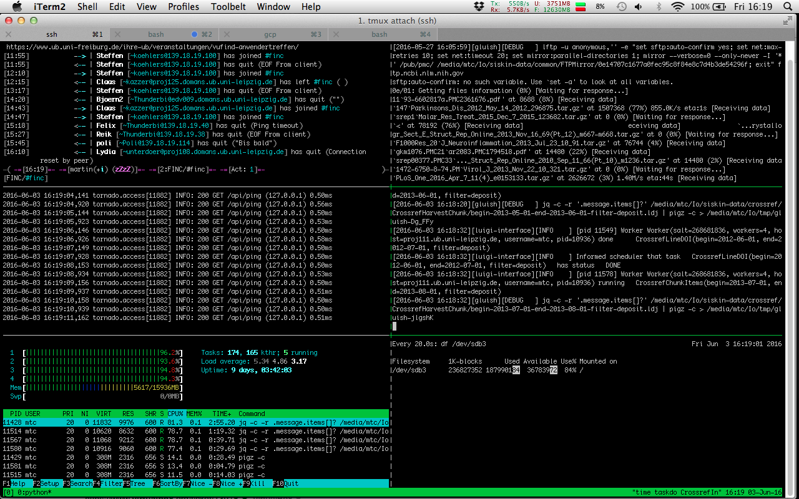

BYOI: Additional topics
=======================

Some more topics.

Parameters
==========

* luigi has typed parameters
* `DateTimeParameter` for things that need to be done regularly

Parameters
==========

```python
class CrossrefHarvestChunk(CrossrefTask):
    """
    Harvest a slice of Crossref.

    API docs: http://api.crossref.org/

    The output file is line delimited JSON,
    just the concatenated responses.
    """
    begin = luigi.DateParameter()
    end = luigi.DateParameter()
    ...
```

Workers
=======



Hooks
=====

* luigi has two hooks, `on_success` and `on_failure`

Gluish
======

* small helper library for luigi
* [ubleipzig/gluish](https://github.com/ubleipzig/gluish)

Go
==

* compiled, statically linked
* modern and ancient
* comprehensive standard library
* focus on simplicity

Go
==

* nice XML and JSON bindings in standard library
* JSON example: [doaj/document.go](https://github.com/ubleipzig/span/blob/master/sources/doaj/document.go)
* complex XML example: [elsevier/dataset.go](https://github.com/ubleipzig/span/blob/master/sources/elsevier/dataset.go)
