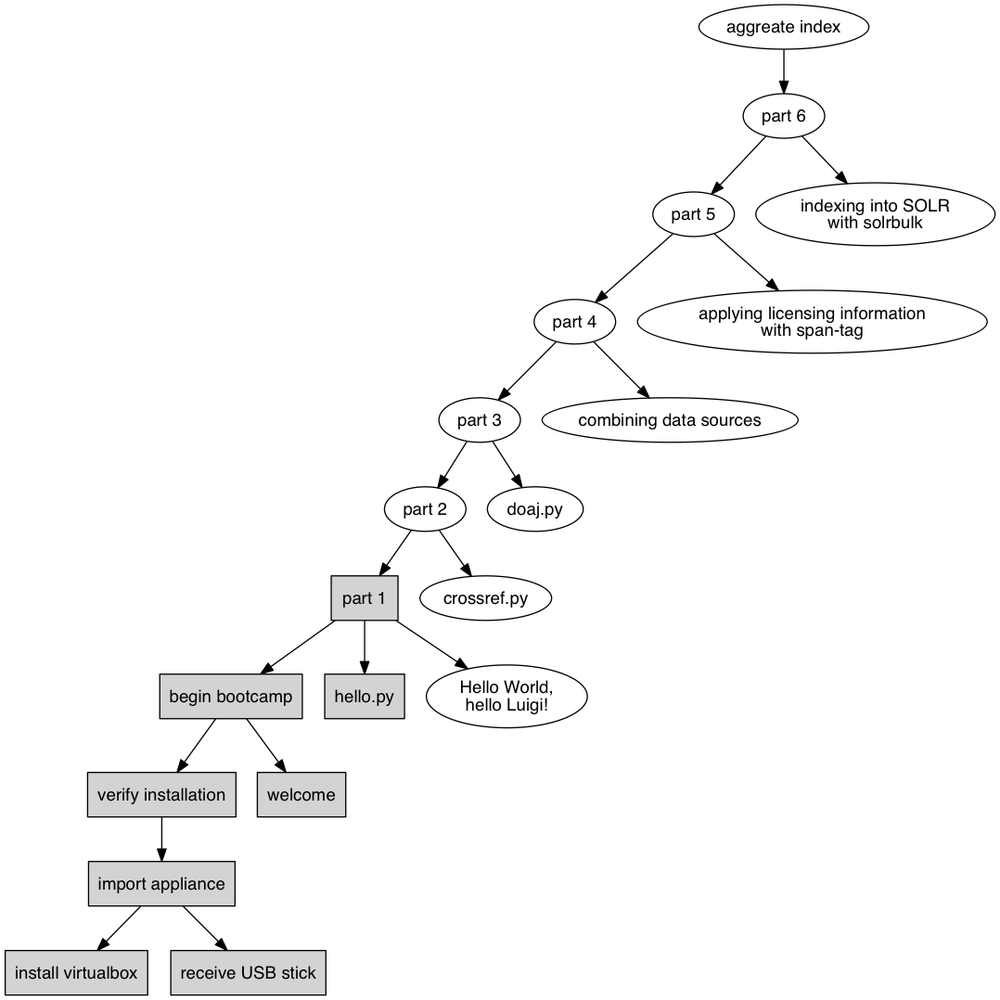

BYOI: Build you own index
=========================

> Heute baue ich meinen eigenen Artikelindex – Hands-On Workshop zum leichtgewichtigen Metadatenprozessing.

5th German Vufind Meetup 2016,
2016--10--11, Freiburg, University Library Freiburg
[is.gd/iQYDZB](https://www.ub.uni-freiburg.de/ihre-ub/veranstaltungen/vufind-anwendertreffen/)

Martin Czygan, David Aumüller, Leander Seige

Leipzig University Library

* [https://ub.uni-leipzig.de](https://ub.uni-leipzig.de)
* [https://finc.info](https://finc.info)
* [https://amsl.technology](https://amsl.technology)
* [itprojekte@ub.uni-leipzig.de](mailto:itprojekte@ub.uni-leipzig.de)

Welcome
=======

During the next few hours, we will create an small
aggregated index from scratch.

You can code along if you like. Code, data and
slides are distributed in a VM (on a USB stick).

Why
===

At Leipzig University Library we built a version
that serves as a successor to a commercial
product.

Index includes data from *Crossref*, *DOAJ*,
JSTOR, Elsevier, Genios, Thieme, DeGruyter among
others.

Various coverages per library, from 55% to 70%. Potentially growable in
breadth and depth.

Format
======

We will use a combination of

* slides to motivate concepts and
* live coding and experimentation

--

We will not use a product, we will build it.

Goals
-----

* a running VuFind 3 with a small aggregated index
* learn about a batch processing framework

First Steps
===========


Prerequisites
=============

* Virtualbox: https://www.virtualbox.org/wiki/Downloads

Import Appliance
================

On the USB-Stick you can find an OVA file that you
can import into Virtualbox (or try to download it
from https://goo.gl/J7hcYC).

This VM contains:

* a VuFind 3 installation -- `/usr/local/vufind`
* raw metadata (around 3M records) -- `~/Bootcamp/input`
* scripts and stubs for processing -- `~/Bootcamp/code`
* these slides -- `~/Bootcamp/slides.pdf`

Forwarded ports
===============

    Guest (VM)  >>  Host
    80          >>  8085  (HTTP, VuFind)
    8080        >>  8086  (SOLR)
    8082        >>  8087  (luigi)
    22          >>  2200  (SSH)
    3306        >>  13306 (MySQL)

SSH tip:

    $ curl -sL https://git.io/vrxoC > vm.sh
    $ chmod +x vm.sh
    $ ./vm.sh

Outline
=======

Bootcamp play book:

* intro: problem setting (heterogenous data, batch processing)
* VM setup - during intro

Then we will write some code:

* a basic pipeline with luigi python library
* combine various sources into a common format
* apply licensing information
* index into solr

Outline DAG
===========



Intro: Problem setting
======================

* batch processing, not small data (but not too big, either)
* regular processing required
* varying requirements
* multiple small steps to apply on all data
* iterative development

Intro: Rise of the DAG
======================

* DAG = directed acyclic graph, partial ordering
* many things use DAGs, make, Excel, scheduling problems
* model tasks in a DAG, then run topological sort to determine order

Examples:

* [http://goo.gl/FCpxiK](http://goo.gl/FCpxiK) (history is a DAG)
* [http://i.stack.imgur.com/iVNcu.png](http://i.stack.imgur.com/iVNcu.png) (airflow)
* [https://git.io/vw9rW](https://git.io/vw9rW) (luigi)
* [https://goo.gl/vMEezR](https://goo.gl/vMEezR) (Azkaban)

Intro: Immutability
===================

* immutability = data is not modified, after it is created
* immutable data has some advantages, e.g.
    * "human fault tolerance"
    * performance
* our use case: recompute everything from raw data
* tradeoff: more computation, but less to think about

Intro: Frameworks
=================

* many libraries and frameworks for batch processing and scheduling, e.g. Oozie, Askaban, Airflow, luigi, ...
* even more tools, when working with stream, Kafka, various queues, ...
* luigi is nice, because it has only a few prerequisities

Intro: Luigi in one slide
=========================

```python
import luigi

class MyTask(luigi.Task):
    param = luigi.Parameter(default='ABC')

    def requires(self):
	return SomeOtherTask()

    def run(self):
	with self.output().open('w') as output:
	    output.write('%s business' % self.param)

    def output(self):
	return luigi.LocalTarget(path='output.txt')

if __name__ == '__main__':
    luigi.run()
```

Intro: luigi
============

* many integrations, e.g. MySQL, Postgres, elasticsearch, ...
* support for Hadoop and HDFS, S3, Redshift, ...
* 200+ contributors, 350+ ML
* hackable, extendable -- e.g. [https://github.com/ubleipzig/gluish](https://github.com/ubleipzig/gluish)

Intro: Decomposing our goal
===========================

* clean and rearrange input data files
* convert data into a common (intermediate) format
* apply licensing information (from kbart)
* index into solr

Intro: Incremental Development
==============================

* when we work with unknown data sources, we have to gradually move forward

Intro: Wrap up
==============

* many approaches to data processing
* we will focus on one library only here
* concepts like immutability, recomputation and incremental development are more general

--

* now back to the code

Test VuFind installation
========================

We can SSH into the VM and start VuFind:

```
$ ./vm.sh
(vm) $ cd /usr/local/vufind
(vm) $ ./solr.sh start
Starting VuFind ...
...
```

- [http://localhost:8085/vufind](http://localhost:8085/vufind)
- [http://localhost:8085/vufind/Install/Home](http://localhost:8085/vufind/Install/Home)

----

Hello World
===========

Test a Python script on guest. Go to the Bootcamp
directory:

```
$ cd $HOME/Bootcamp
$ python hello.py
...
```

Note: Files follow PEP-8, so indent with space, here: 4.

----

Setup wrap-up
=============

You can now edit Python files on your guest (or
host) and run them inside the VM. You can start
and stop VuFind inside the VM and access it
through a browser on your host.

We are all set ot start exploring the data and to write some code.

Bootcamp outline
================

* parts 0 to 6: intro, crossref, doaj, combination, licensing, export
* each part is self contained, although we will reuse some artifacts

Bootcamp outline
================

* you can use scaffoldP_..., if you want to code along
* the partP_... files contain the target code

```
code/part{0-6}_....py
code/scaffold{0-6}_....py
```

Coding: Part 0
==============

* Hello World from luigi

```
$ cd code
$ python part0_helloworld.py
```

Coding: Part 0 Recap
====================

* simple things should be simple
* basic notion of a task
* command line integration

Coding: Part 1
==============

* An input and a task

```
$ python part1_require.py
```

Coding: Part 1 Recap
====================

* it is easy to start with static data
* business logic in python, can reuse any existing python library

Coding: Part 2
==============

* a first look at Crossref data
* harvest via API, the files contain batch responses
* custom format

Coding: Part 2
==============

Three things to do:

* find all relevant files (we will use just one for now)
* extract the records from the batch
* convert to an intermediate format

Coding: Part 2
==============

* Now on to the code

```
$ python part2_crossref.py
```

Coding: Part 2 Recap
====================

* used command line tools (fast, simple interface)
* chained three tasks together

Excursion: Normalization
========================

* suggested and designed by system librarian
* internal name: intermediate schema -- [https://github.com/ubleipzig/intermediateschema](https://github.com/ubleipzig/intermediateschema)
* enough fields to accomodate various inputs
* can be extended carefully, if necessary
* tooling (licensing, export, quality checks) only for a single format

Excursion: Normalization
========================

```
{
  "finc.format": "ElectronicArticle",
  "finc.mega_collection": "DOAJ",
  "finc.record_id": "ai-28-00001...",
  "finc.source_id": "28",
  "rft.atitle": "Importância da vitamina B12 na ...",
  "rft.epage": "78",
  "rft.issn": [
    "1806-5562",
    "1980-6108"
  ],
  "rft.jtitle": "Scientia Medica",
  ...
}
```

Coding: Part 3
==============

* DOAJ index data
* a complete elasticsearch dump

Coding: Part 3
==============

This source is not batched and comes in a single file, so it is a bit simpler:

* locate file
* convert to intermediate schema

```
$ python part3_require.py
```

Coding: Part 3 Recap
====================

* it is easy to start with static data
* business logic in python, can reuse any existing python library

Coding: Part 4
==============

* after normalization, we can merge the two data sources

```
$ python part4_combine.py
```

Coding: Part 4 Recap
====================

* a list of dependencies
* python helps with modularization
* using the shell for performance and to reuse existing tools

Coding: Part 5
==============

* licensing turned out to be an important issue
* a complex topic
* we need to look at every record, so it is performance critical
* we use AMSL for ERM, and are on the way to a self-service interface
* AMSL has great APIs
* we convert collection information to an expression-tree-ish format -- [https://is.gd/Fxx0IU](https://is.gd/Fxx0IU), [https://is.gd/ZTqLqB](https://is.gd/ZTqLqB)

Coding: Part 5
==============

```
$ python part5_licensing.py
```

Coding: Part 5
==============

* boolean expression trees allow us to specify complex licensing rules
* the result is a file, where each record is annotated with an ISIL
* at Leipzig University Library we currently do this for about 20 ISILs

Coding: Part 5 Recap
====================

* dependencies as dictionary
* flexibility in modeling workflows
* again: use command line tools for performance critical parts

Coding: Part 6
==============

* a final conversion to a SOLR-importable format

Coding: Part 6
==============

```
$ python part6_export.py
```

Coding: Part 6
==============

* slightly different from SOLRMARC style processing
* keep things (conversion, indexing) a bit separate
* standalone tool: [solrbulk](https://github.com/ubleipzig/solrbulk)

Coding: Part 6 Recap
====================

* flexibility in modeling workflows
* again: use command line tools for performance critical parts

Indexing
========

* finally, we can index the data into SOLR
* make sure SOLR is running on your VM

Indexing
========

```sh
$ solrbulk -host localhost -port 8080 \
	   -w 2 -z -verbose -commit 100000 \
	   -collection biblio \
	   output/6/Export/output.ldj.gz
```

* might want to increase SOLR_HEAP (defaults to 512M)

Indexing
========

* go to [http://localhost:8085](http://localhost:8085)
* index should be slowly growing

Code recap
==========

```sh
 \_ Export()
    \_ ApplyLicensing()
       \_ CombinedIntermediateSchema()
	  \_ DOAJIntermediateSchema()
	     \_ DOAJInput()
	  \_ CrossrefIntermediateSchema()
	     \_ CrossrefItems()
		\_ CrossrefInput()
       \_ CreateConfiguration()
	  \_ HoldingFile()
```

Code recap
==========

```sh
$ python deps.py
 \_ Export()
    \_ ApplyLicensing()
       \_ CombinedIntermediateSchema()
	  \_ DOAJIntermediateSchema()
	     \_ DOAJInput()
	  \_ CrossrefIntermediateSchema()
	     \_ CrossrefItems()
		\_ CrossrefInput()
       \_ CreateConfiguration()
	  \_ HoldingFile()
```

Code recap
==========


Follow up with workflow changes
===============================

* [https://git.io/vOZFQ](https://git.io/vOZFQ)

Indexing
========

Production data points:

* sustained indexing rates between 2000-4000 docs/s
* a full reindex of about 100M docs currently takes about 10h with SOLR

Discussion
==========

what we left out:

* more data sets
* larger data sets
* XML
* errors
* parameters
* collaboration and deployment

Discussion
==========

* what are your experiences with batch systems?
* how do you manage large heterogeneous data?
* what could we add to the pipeline?

Q & A
=====

Thanks for your attention.

For any questions, please get in touch during the
conference or via e-mail:

    {czygan,aumueller,seige}@ub.uni-leipzig.de
