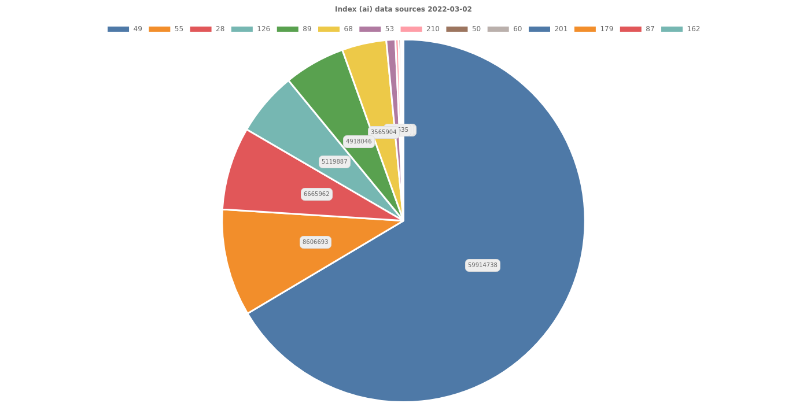
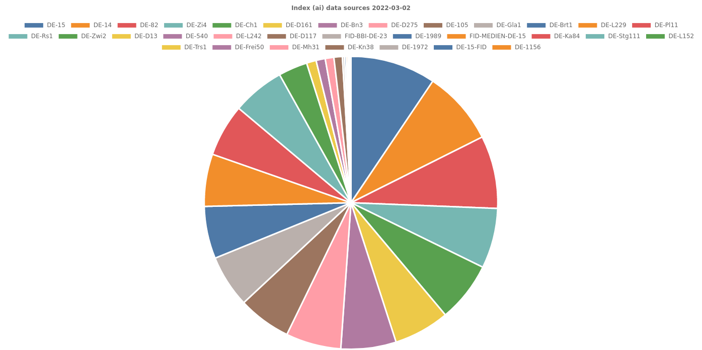

# Zur Person

* Martin Czygan <czygan@ub.uni-leipzig.de>
* Softwareentwickler UBL; Open Data Engineer, Internet Archive -- https://scholar.archive.org; Lecturer/Lehrbeauftragter Lancaster U Leipzig, HAW Hamburg; Co-Host Leipzig Gophers https://golangleipzig.space/

---

# **Artikelindex**

> Teil des Index-Angebots der UB Leipzig

Technische Beiträge von: David Aumüller, Evelyn Weiser, Frank Morgner, *Martin Czygan*, Robert Schenk, Stefanie Nooke, Thomas Gängler, Thomas Gersch, Tracy Hoffmann

Sowie: Andreas Czerniak, David Glueck, Gunnar Þór Magnússon, Justin Kelly,  Natanael Arndt

* 100% Open Source: https://github.com/ubleipzig 

---

# **Quellen**

* 90,157,793 Artikelmetadaten, 14 Datenquellen (TODO: ISSN)

---

# Einrichtungen

* aktuell 32 Bibliotheken und Projekte

----

# Daten

* offene Daten: Crossref, DOAJ, OSF, ...
* verhandelt/lizensiert: IEEE, Jstor, Ceeol, ...

----

# Technischer Prozess

* Datenakquise
* Normalisierung (intermediate schema)
* Ansigelung und Deduplizierung
* Indexierung

Automatisiert, jedoch kontinuierliche Addressierung von Fehlern und
Veränderungen (Bsp: Umstellung des Bezugs von Crossref in 12/2022).